# Diagrama de Casos de Uso — SGM Backend API

## ¿Qué es un Diagrama de Casos de Uso?

Un Diagrama de Casos de Uso muestra **qué puede hacer cada usuario en el sistema**, sin entrar en detalles técnicos de cómo se hace. Tiene estos elementos:

| Elemento | Forma visual | Qué representa |
|---|---|---|
| **Actor** | Figura de palito (stickman) | Usuario o sistema externo que interactúa con el sistema |
| **Caso de uso** | Óvalo / elipse | Una acción que el sistema puede realizar |
| **Límite del sistema** | Rectángulo grande | Encierra todos los casos de uso del sistema |
| **Asociación** | Línea sólida | Conecta un actor con un caso de uso que puede ejecutar |
| **Include** | Flecha punteada `<<include>>` | El caso de uso A siempre ejecuta B (B es obligatorio) |
| **Extend** | Flecha punteada `<<extend>>` | El caso de uso A puede opcionalmente ejecutar B |
| **Herencia** | Flecha con triángulo vacío | Un actor hereda todos los casos de uso de otro |

---

## Actores del Sistema SGM

El sistema tiene **5 actores** extraídos del seed real de la base de datos:

### Actor 1 — Administrador
- Acceso completo a todos los casos de uso del sistema
- Gestiona usuarios, roles, permisos, catálogo, solicitudes, traslados, reportes y organización
- El `PermisosGuard` le concede todos los permisos automáticamente
- **Restricción de negocio (no es un permiso, es una regla de servicio):** NO puede aprobar/rechazar una solicitud o traslado dirigido a un sitio que ya tiene un `Responsable de Bodega` asignado. Solo puede aprobar si el sitio no tiene responsable, o si él mismo es el responsable de ese sitio. Tampoco puede aprobar/rechazar algo que él mismo creó.

### Actor 2 — Instructor
- Acceso de lectura a la mayoría de módulos
- Puede crear solicitudes, traslados, devoluciones, chequeos y actas
- No puede aprobar/rechazar, gestionar usuarios ni generar reportes

### Actor 3 — Aprendiz
- Acceso mínimo al sistema
- Solo puede ver inventario, productos, items y sus propias solicitudes
- Puede crear solicitudes de préstamo
- No puede ver traslados, devoluciones, chequeos ni reportes

### Actor 4 — Responsable de Bodega *(nuevo rol)*
- Asignado a un sitio específico (bodega, ambiente o laboratorio) vía `sitio.id_responsable`
- Es el único que puede aprobar/rechazar/entregar solicitudes y traslados dirigidos a **su** sitio
- No puede crear solicitudes ni traslados (no tiene `crear_solicitudes` ni `crear_traslados`)
- También puede registrar devoluciones, chequeos y actas, igual que el Instructor
- **Restricción de negocio:** tampoco puede aprobar/rechazar algo que él mismo haya creado (aunque en la práctica no crea solicitudes, la regla se valida igual en el backend)

### Actor 5 — Sistema (automatizado)
- Representa los procesos automáticos ejecutados por BullMQ en segundo plano
- Envía emails y procesa colas de reportes sin intervención humana
- No es un usuario humano — es el worker de Redis/BullMQ

---

## Permisos Reales por Rol (extraídos del seed.ts)

### Administrador — permisos completos (36 permisos)
`ver_inventario` `crear_inventario` `editar_inventario`
`ver_productos` `crear_productos` `editar_productos` `eliminar_productos`
`ver_items` `crear_items` `editar_items`
`ver_solicitudes` `crear_solicitudes` `aprobar_solicitudes` `rechazar_solicitudes` `entregar_solicitudes`
`ver_devoluciones` `crear_devoluciones`
`ver_movimientos` `crear_movimientos`
`ver_reportes`
`ver_usuarios` `crear_usuarios` `editar_usuarios`
`ver_chequeos` `crear_chequeos`
`ver_actas` `crear_actas`
`ver_notificaciones`
`ver_dashboard`
`ver_roles`
`ver_fichas`
`ver_sitios`
`ver_traslados` `crear_traslados` `aprobar_traslados` `rechazar_traslados`

### Instructor — permisos de lectura + operaciones básicas (18 permisos)
`ver_inventario`
`ver_productos`
`ver_items`
`ver_solicitudes` `crear_solicitudes`
`ver_devoluciones` `crear_devoluciones`
`ver_movimientos`
`ver_chequeos` `crear_chequeos`
`ver_actas` `crear_actas`
`ver_notificaciones`
`ver_dashboard`
`ver_fichas`
`ver_sitios`
`ver_traslados` `crear_traslados`

### Aprendiz — acceso mínimo (6 permisos)
`ver_inventario`
`ver_productos`
`ver_items`
`ver_solicitudes` `crear_solicitudes`
`ver_notificaciones`
`ver_dashboard`

### Responsable de Bodega — aprobador de su sitio (20 permisos)
`ver_inventario`
`ver_productos`
`ver_items`
`ver_solicitudes` `aprobar_solicitudes` `rechazar_solicitudes` `entregar_solicitudes`
`ver_traslados` `aprobar_traslados` `rechazar_traslados`
`ver_devoluciones` `crear_devoluciones`
`ver_chequeos` `crear_chequeos`
`ver_actas` `crear_actas`
`ver_notificaciones`
`ver_dashboard`
`ver_fichas`
`ver_sitios`

**Nota:** a diferencia del Administrador, este rol NO tiene `crear_solicitudes` ni `crear_traslados` — su función es exclusivamente aprobar/gestionar lo que otros solicitan hacia su sitio.

---

## Regla de Negocio Transversal — Restricciones Adicionales de Aprobación

El `PermisosGuard` solo verifica si el usuario **tiene el permiso** (`aprobar_solicitudes`, `aprobar_traslados`, etc.). Pero aprobar/rechazar una solicitud o traslado tiene **dos restricciones adicionales** que se validan en la capa de Aplicación (`SolicitudesService` / `TrasladosService`), no en el guard:

1. **Anti-autoaprobación:** ningún usuario puede aprobar/rechazar una solicitud o traslado que él mismo creó — sin importar su rol. Lanza `AutoAprobacionSolicitudForbiddenException` / `AutoAprobacionTrasladoForbiddenException` (HTTP 403).
2. **Solo el responsable del sitio:** si el sitio de destino (solicitud) o de origen (traslado) tiene un `Responsable de Bodega` asignado (`sitio.id_responsable`), **solo ese usuario** puede aprobar/rechazar — ni siquiera el Administrador puede hacerlo, a menos que el Administrador sea el propio responsable de ese sitio. Si el sitio NO tiene responsable asignado, el Administrador puede aprobar como respaldo. Lanza `SoloResponsablePuedeAprobarSolicitudForbiddenException` / `SoloResponsablePuedeAprobarTrasladoForbiddenException` (HTTP 403).

Estas dos reglas se aplican en cascada, en este orden, dentro de UC20, UC21, UC25 y UC26.

---

## Casos de Uso por Grupo

### Grupo 1 — Autenticación (sin permiso — `@Public()`)
- UC01: Iniciar sesión
- UC02: Renovar token de acceso

### Grupo 2 — Usuarios y Seguridad (solo Administrador)
- UC03: Gestionar usuarios (crear, editar, activar/desactivar)
- UC04: Asignar rol a usuario
- UC05: Gestionar roles
- UC06: Gestionar permisos
- UC07: Asignar permiso individual a usuario

### Grupo 3 — Organización (solo Administrador)
- UC08: Gestionar sedes y centros de formación
- UC09: Gestionar fichas y programas
- UC10: Gestionar sitios (almacenes, aulas, laboratorios)

### Grupo 4 — Catálogo e Inventario
- UC11: Ver productos *(Admin + Instructor + Aprendiz)*
- UC12: Crear / Editar / Eliminar producto *(solo Admin)*
- UC13: Ver items *(Admin + Instructor + Aprendiz)*
- UC14: Crear / Editar item *(solo Admin)*
- UC15: Generar código QR de item *(solo Admin)*
- UC16: Ver inventario *(Admin + Instructor + Aprendiz)*
- UC17: Ajustar inventario *(solo Admin)*

### Grupo 5 — Solicitudes de Préstamo
- UC18: Crear solicitud *(Admin + Instructor + Aprendiz)*
- UC19: Ver solicitudes *(Admin + Instructor + Aprendiz + Responsable de Bodega)*
- UC20: Aprobar solicitud *(Admin condicional* + Responsable de Bodega)*
- UC21: Rechazar solicitud *(Admin condicional* + Responsable de Bodega)*
- UC22: Entregar solicitud *(Admin + Responsable de Bodega)*

*Admin condicional = solo si el sitio no tiene responsable asignado, o si el Admin es el responsable de ese sitio. Ver "Regla de Negocio Transversal".

### Grupo 6 — Traslados
- UC23: Crear traslado *(Admin + Instructor)*
- UC24: Ver traslados *(Admin + Instructor + Responsable de Bodega)*
- UC25: Aprobar traslado *(Admin condicional* + Responsable de Bodega)*
- UC26: Rechazar traslado *(Admin condicional* + Responsable de Bodega)*

### Grupo 7 — Asignaciones y Devoluciones
- UC27: Crear asignación *(solo Admin)*
- UC28: Ver asignaciones *(solo Admin)*
- UC29: Registrar devolución *(Admin + Instructor + Responsable de Bodega)*
- UC30: Ver devoluciones *(Admin + Instructor + Responsable de Bodega)*

### Grupo 8 — Control y Trazabilidad
- UC31: Crear chequeo de inventario *(Admin + Instructor + Responsable de Bodega)*
- UC32: Ver chequeos *(Admin + Instructor + Responsable de Bodega)*
- UC33: Crear acta de cierre *(Admin + Instructor + Responsable de Bodega)*
- UC34: Ver actas *(Admin + Instructor + Responsable de Bodega)*

*(UC35 "Ver historial de movimientos" fue retirado — el módulo `movimientos` se eliminó del sistema junto con `ordenes-compra`. El historial de un item ahora se consulta vía UC "Ver kardex", cubierto dentro de UC16 "Ver inventario" con el permiso `ver_inventario`.)*

### Grupo 9 — Reportes y Notificaciones
- UC36: Ver notificaciones *(Admin + Instructor + Aprendiz + Responsable de Bodega)*
- UC37: Ver reportes *(solo Admin)*
- UC38: Generar reporte PDF *(solo Admin)*
- UC39: Generar reporte Excel *(solo Admin)*

### Grupo 10 — Procesos Automáticos (Actor: Sistema)
- UC40: Enviar email automático
- UC41: Procesar cola de reportes

---

## Tabla de Acceso por Actor

| # | Caso de Uso | Administrador | Instructor | Aprendiz | Responsable de Bodega | Sistema |
|---|---|:---:|:---:|:---:|:---:|:---:|
| UC01 | Iniciar sesión | ✅ | ✅ | ✅ | ✅ | — |
| UC02 | Renovar token | ✅ | ✅ | ✅ | ✅ | — |
| UC03 | Gestionar usuarios | ✅ | — | — | — | — |
| UC04 | Asignar rol a usuario | ✅ | — | — | — | — |
| UC05 | Gestionar roles | ✅ | — | — | — | — |
| UC06 | Gestionar permisos | ✅ | — | — | — | — |
| UC07 | Asignar permiso individual | ✅ | — | — | — | — |
| UC08 | Gestionar sedes y centros | ✅ | — | — | — | — |
| UC09 | Gestionar fichas y programas | ✅ | — | — | — | — |
| UC10 | Gestionar sitios | ✅ | — | — | — | — |
| UC11 | Ver productos | ✅ | ✅ | ✅ | ✅ | — |
| UC12 | Crear / Editar / Eliminar producto | ✅ | — | — | — | — |
| UC13 | Ver items | ✅ | ✅ | ✅ | ✅ | — |
| UC14 | Crear / Editar item | ✅ | — | — | — | — |
| UC15 | Generar código QR | ✅ | — | — | — | — |
| UC16 | Ver inventario | ✅ | ✅ | ✅ | ✅ | — |
| UC17 | Ajustar inventario | ✅ | — | — | — | — |
| UC18 | Crear solicitud | ✅ | ✅ | ✅ | — | — |
| UC19 | Ver solicitudes | ✅ | ✅ | ✅ | ✅ | — |
| UC20 | Aprobar solicitud | ⚠️ condicional | — | — | ✅ | — |
| UC21 | Rechazar solicitud | ⚠️ condicional | — | — | ✅ | — |
| UC22 | Entregar solicitud | ✅ | — | — | ✅ | — |
| UC23 | Crear traslado | ✅ | ✅ | — | — | — |
| UC24 | Ver traslados | ✅ | ✅ | — | ✅ | — |
| UC25 | Aprobar traslado | ⚠️ condicional | — | — | ✅ | — |
| UC26 | Rechazar traslado | ⚠️ condicional | — | — | ✅ | — |
| UC27 | Crear asignación | ✅ | — | — | — | — |
| UC28 | Ver asignaciones | ✅ | — | — | — | — |
| UC29 | Registrar devolución | ✅ | ✅ | — | ✅ | — |
| UC30 | Ver devoluciones | ✅ | ✅ | — | ✅ | — |
| UC31 | Crear chequeo | ✅ | ✅ | — | ✅ | — |
| UC32 | Ver chequeos | ✅ | ✅ | — | ✅ | — |
| UC33 | Crear acta | ✅ | ✅ | — | ✅ | — |
| UC34 | Ver actas | ✅ | ✅ | — | ✅ | — |
| UC36 | Ver notificaciones | ✅ | ✅ | ✅ | ✅ | — |
| UC37 | Ver reportes | ✅ | — | — | — | — |
| UC38 | Generar reporte PDF | ✅ | — | — | — | — |
| UC39 | Generar reporte Excel | ✅ | — | — | — | — |
| UC40 | Enviar email automático | — | — | — | — | ✅ |
| UC41 | Procesar cola de reportes | — | — | — | — | ✅ |

⚠️ condicional = solo si el sitio no tiene responsable asignado, o si el propio Admin es el responsable de ese sitio (ver "Regla de Negocio Transversal").

---

## Especificación Completa para Crear el Diagrama (para pasar a una IA)

### ACTORES — 5 actores, van FUERA del rectángulo del sistema

- **Administrador** — figura de palito, lado izquierdo arriba
- **Instructor** — figura de palito, lado izquierdo centro-arriba
- **Aprendiz** — figura de palito, lado izquierdo centro
- **Responsable de Bodega** — figura de palito, lado izquierdo centro-abajo
- **Sistema** — figura de engranaje, lado derecho

### LÍMITE DEL SISTEMA

Rectángulo grande que encierra todo, etiquetado: **"SGM — Sistema de Gestión de Materiales"**

### ÓVALOS DENTRO DEL RECTÁNGULO — 41 casos de uso en 10 grupos

Cada grupo tiene fondo de color distinto:

**GRUPO 1 — Autenticación** (gris)
- Óvalo: "Iniciar sesión" (UC01)
- Óvalo: "Renovar token" (UC02)

**GRUPO 2 — Usuarios y Seguridad** (rojo claro)
- Óvalo: "Gestionar usuarios" (UC03)
- Óvalo: "Asignar rol a usuario" (UC04)
- Óvalo: "Gestionar roles" (UC05)
- Óvalo: "Gestionar permisos" (UC06)
- Óvalo: "Asignar permiso individual" (UC07)

**GRUPO 3 — Organización** (azul claro)
- Óvalo: "Gestionar sedes y centros" (UC08)
- Óvalo: "Gestionar fichas y programas" (UC09)
- Óvalo: "Gestionar sitios" (UC10)

**GRUPO 4 — Catálogo e Inventario** (verde claro)
- Óvalo: "Ver productos" (UC11)
- Óvalo: "Crear / Editar / Eliminar producto" (UC12)
- Óvalo: "Ver items" (UC13)
- Óvalo: "Crear / Editar item" (UC14)
- Óvalo: "Generar código QR" (UC15)
- Óvalo: "Ver inventario" (UC16)
- Óvalo: "Ajustar inventario" (UC17)

**GRUPO 5 — Solicitudes** (amarillo)
- Óvalo: "Crear solicitud" (UC18)
- Óvalo: "Ver solicitudes" (UC19)
- Óvalo: "Aprobar solicitud" (UC20)
- Óvalo: "Rechazar solicitud" (UC21)
- Óvalo: "Entregar solicitud" (UC22)

**GRUPO 6 — Traslados** (naranja)
- Óvalo: "Crear traslado" (UC23)
- Óvalo: "Ver traslados" (UC24)
- Óvalo: "Aprobar traslado" (UC25)
- Óvalo: "Rechazar traslado" (UC26)

**GRUPO 7 — Asignaciones y Devoluciones** (morado claro)
- Óvalo: "Crear asignación" (UC27)
- Óvalo: "Ver asignaciones" (UC28)
- Óvalo: "Registrar devolución" (UC29)
- Óvalo: "Ver devoluciones" (UC30)

**GRUPO 8 — Control y Trazabilidad** (verde agua)
- Óvalo: "Crear chequeo" (UC31)
- Óvalo: "Ver chequeos" (UC32)
- Óvalo: "Crear acta" (UC33)
- Óvalo: "Ver actas" (UC34)

*(UC35 eliminado — módulo `movimientos` ya no existe)*

**GRUPO 9 — Reportes y Notificaciones** (rosa claro)
- Óvalo: "Ver notificaciones" (UC36)
- Óvalo: "Ver reportes" (UC37)
- Óvalo: "Generar reporte PDF" (UC38)
- Óvalo: "Generar reporte Excel" (UC39)

**GRUPO 10 — Procesos Automáticos** (gris azulado)
- Óvalo: "Enviar email automático" (UC40)
- Óvalo: "Procesar cola de reportes" (UC41)

### LÍNEAS DE ASOCIACIÓN (línea sólida actor → óvalo)

**Administrador** conecta con: UC01 al UC39 (todos excepto UC40 y UC41). Las líneas hacia UC20, UC21, UC25, UC26 deben marcarse como **"condicional"** (línea sólida con etiqueta pequeña "⚠️ solo si no hay responsable asignado") — ver Regla de Negocio Transversal.

**Instructor** conecta con:
UC01, UC02, UC11, UC13, UC16, UC18, UC19, UC23, UC24, UC29, UC30, UC31, UC32, UC33, UC34, UC36

**Aprendiz** conecta con:
UC01, UC02, UC11, UC13, UC16, UC18, UC19, UC36

**Responsable de Bodega** conecta con:
UC01, UC02, UC11, UC13, UC16, UC19, UC20, UC21, UC22, UC24, UC25, UC26, UC29, UC30, UC31, UC32, UC33, UC34, UC36

**Sistema** conecta con:
UC40, UC41

### RELACIONES ENTRE ÓVALOS

**`<<include>>`** — flecha punteada de UC_A hacia UC_B, significa que A siempre ejecuta B:
- UC20 (Aprobar solicitud) → UC19 (Ver solicitudes)
- UC21 (Rechazar solicitud) → UC19 (Ver solicitudes)
- UC22 (Entregar solicitud) → UC19 (Ver solicitudes)
- UC25 (Aprobar traslado) → UC24 (Ver traslados)
- UC26 (Rechazar traslado) → UC24 (Ver traslados)
- UC29 (Registrar devolución) → UC19 (Ver solicitudes)
- UC33 (Crear acta) → UC32 (Ver chequeos)
- UC38 (Generar PDF) → UC37 (Ver reportes)
- UC39 (Generar Excel) → UC37 (Ver reportes)

**`<<extend>>`** — flecha punteada de UC_A hacia UC_B, significa que A opcionalmente ejecuta B:
- UC14 (Crear item) → UC15 (Generar código QR)
- UC25 (Aprobar traslado) → UC40 (Enviar email automático)
- UC20 (Aprobar solicitud) → UC40 (Enviar email automático)

---

## Diagrama en Mermaid

Pega este código en https://mermaid.live para generar el visual:

```mermaid
flowchart LR
    ADM(["👤 Administrador"])
    INS(["👤 Instructor"])
    APR(["👤 Aprendiz"])
    RES(["👤 Responsable de Bodega"])
    SIS(["⚙️ Sistema\nBullMQ"])

    subgraph SGM["Sistema de Gestión de Materiales — SGM"]

        subgraph AUTH["Autenticación"]
            UC01(["Iniciar sesión"])
            UC02(["Renovar token"])
        end

        subgraph USUARIOS["Usuarios y Seguridad"]
            UC03(["Gestionar usuarios"])
            UC04(["Asignar rol"])
            UC05(["Gestionar roles"])
            UC06(["Gestionar permisos"])
            UC07(["Asignar permiso\nindividual"])
        end

        subgraph ORG["Organización"]
            UC08(["Gestionar sedes\ny centros"])
            UC09(["Gestionar fichas\ny programas"])
            UC10(["Gestionar sitios"])
        end

        subgraph CATALOGO["Catálogo e Inventario"]
            UC11(["Ver productos"])
            UC12(["Crear / Editar /\nEliminar producto"])
            UC13(["Ver items"])
            UC14(["Crear / Editar item"])
            UC15(["Generar QR"])
            UC16(["Ver inventario"])
            UC17(["Ajustar inventario"])
        end

        subgraph SOLICITUDES["Solicitudes"]
            UC18(["Crear solicitud"])
            UC19(["Ver solicitudes"])
            UC20(["Aprobar solicitud"])
            UC21(["Rechazar solicitud"])
            UC22(["Entregar solicitud"])
        end

        subgraph TRASLADOS["Traslados"]
            UC23(["Crear traslado"])
            UC24(["Ver traslados"])
            UC25(["Aprobar traslado"])
            UC26(["Rechazar traslado"])
        end

        subgraph ASIGNACIONES["Asignaciones y Devoluciones"]
            UC27(["Crear asignación"])
            UC28(["Ver asignaciones"])
            UC29(["Registrar devolución"])
            UC30(["Ver devoluciones"])
        end

        subgraph CONTROL["Control y Trazabilidad"]
            UC31(["Crear chequeo"])
            UC32(["Ver chequeos"])
            UC33(["Crear acta"])
            UC34(["Ver actas"])
        end

        subgraph REPORTES["Reportes y Notificaciones"]
            UC36(["Ver notificaciones"])
            UC37(["Ver reportes"])
            UC38(["Generar PDF"])
            UC39(["Generar Excel"])
        end

        subgraph AUTO["Procesos Automáticos"]
            UC40(["Enviar email\nautomático"])
            UC41(["Procesar cola\nde reportes"])
        end

    end

    %% Administrador — UC01 al UC39
    ADM --- UC01 & UC02 & UC03 & UC04 & UC05 & UC06 & UC07
    ADM --- UC08 & UC09 & UC10
    ADM --- UC11 & UC12 & UC13 & UC14 & UC15 & UC16 & UC17
    ADM --- UC18 & UC19 & UC20 & UC21 & UC22
    ADM --- UC23 & UC24 & UC25 & UC26
    ADM --- UC27 & UC28 & UC29 & UC30
    ADM --- UC31 & UC32 & UC33 & UC34
    ADM --- UC36 & UC37 & UC38 & UC39

    %% Instructor — 16 casos de uso
    INS --- UC01 & UC02
    INS --- UC11 & UC13 & UC16
    INS --- UC18 & UC19
    INS --- UC23 & UC24
    INS --- UC29 & UC30
    INS --- UC31 & UC32 & UC33 & UC34
    INS --- UC36

    %% Aprendiz — 8 casos de uso
    APR --- UC01 & UC02
    APR --- UC11 & UC13 & UC16
    APR --- UC18 & UC19
    APR --- UC36

    %% Responsable de Bodega — 19 casos de uso (aprobador de su sitio)
    RES --- UC01 & UC02
    RES --- UC11 & UC13 & UC16
    RES --- UC19 & UC20 & UC21 & UC22
    RES --- UC24 & UC25 & UC26
    RES --- UC29 & UC30 & UC31 & UC32 & UC33 & UC34
    RES --- UC36

    %% Sistema — procesos automáticos
    SIS --- UC40 & UC41

    %% include
    UC20 -.->|<<include>>| UC19
    UC21 -.->|<<include>>| UC19
    UC22 -.->|<<include>>| UC19
    UC25 -.->|<<include>>| UC24
    UC26 -.->|<<include>>| UC24
    UC33 -.->|<<include>>| UC32
    UC38 -.->|<<include>>| UC37
    UC39 -.->|<<include>>| UC37

    %% extend
    UC14 -.->|<<extend>>| UC15
    UC25 -.->|<<extend>>| UC40
    UC20 -.->|<<extend>>| UC40
```

---

## Resumen de Cantidad

| Elemento | Cantidad |
|---|---|
| Actores | 5 (Administrador, Instructor, Aprendiz, Responsable de Bodega, Sistema) |
| Casos de uso totales | 40 óvalos (UC35 retirado — módulo `movimientos` eliminado) |
| Grupos dentro del sistema | 10 |
| Relaciones `<<include>>` | 8 |
| Relaciones `<<extend>>` | 3 |
| Casos de uso exclusivos del Admin | 20 |
| Casos de uso compartidos Admin + Instructor | 12 |
| Casos de uso compartidos Admin + Instructor + Aprendiz | 8 |
| Casos de uso del Responsable de Bodega | 19 |
| Casos de uso condicionales para Admin (requieren no tener responsable asignado) | 4 (UC20, UC21, UC25, UC26) |
| Casos de uso exclusivos del Sistema | 2 |
