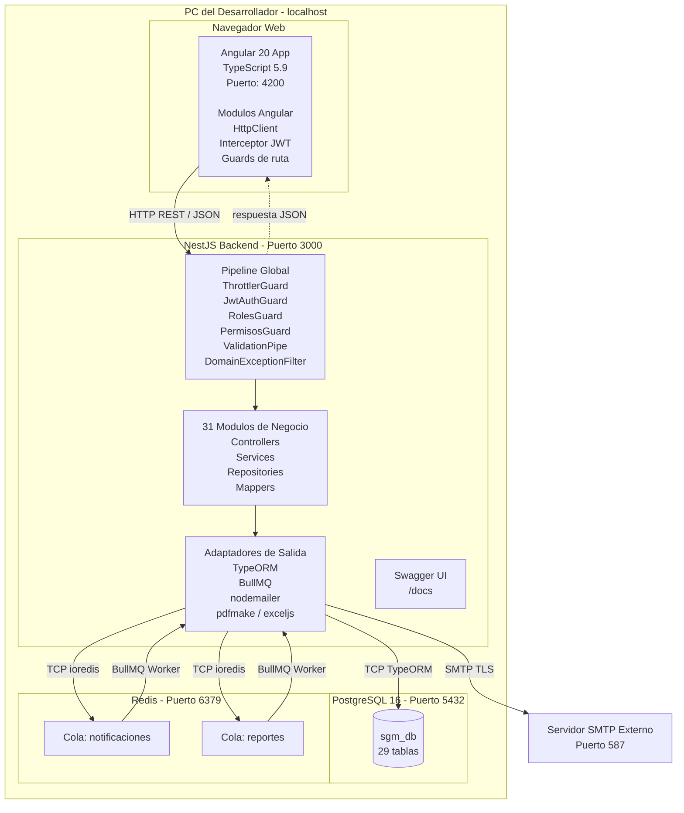

# Diagrama de Despliegue y Componentes — SGM

## ¿Qué es un Diagrama de Despliegue?

Muestra **dónde corre físicamente cada parte del sistema**: qué procesos se ejecutan en qué máquina, en qué puerto, y cómo se comunican entre sí. A diferencia del diagrama de arquitectura (que muestra capas de código), este muestra la infraestructura real.

| Elemento | Forma visual | Qué representa |
|---|---|---|
| **Nodo** | Caja 3D (cubo) | Máquina, servidor, dispositivo o entorno de ejecución |
| **Componente** | Rectángulo con dos rectángulos pequeños a la izquierda | Pieza de software que corre dentro del nodo |
| **Artefacto** | Rectángulo con ícono de documento | Archivo ejecutable, bundle o imagen que se despliega |
| **Comunicación** | Línea entre nodos con etiqueta | Protocolo y puerto usado entre dos nodos |
| **Dependencia** | Flecha punteada | Un componente usa a otro |

---

## Ambiente Actual — Desarrollo Local

Todo el sistema corre en una **sola máquina** (PC del desarrollador). Cada proceso ocupa un puerto distinto:

| Proceso | Puerto | Tecnología |
|---|---|---|
| Frontend Angular | 4200 | Angular 20 + TypeScript 5.9 |
| Backend NestJS | 3000 | NestJS 11 + TypeScript 5.7 |
| Base de datos | 5432 | PostgreSQL 16 |
| Cola / Caché | 6379 | Redis + BullMQ |
| Documentación API | 3000/docs | Swagger / OpenAPI |

---

## Nodos del Sistema

### Nodo 1 — Navegador Web (Chrome / Firefox / Edge)

**Qué es:** El navegador del usuario donde corre la aplicación Angular.

**Componentes dentro:**
- `Angular App` — aplicación compilada en TypeScript 5.9
  - Módulos Angular 20
  - Servicios HTTP (HttpClient → llama al backend)
  - Guards de rutas (controla navegación según rol)
  - Interceptores HTTP (agrega el Bearer token a cada request)
  - Componentes de UI

**Se comunica con:**
- Backend NestJS → `HTTP REST` en `localhost:3000`
- Protocolo: `JSON sobre HTTP`
- Autenticación: Header `Authorization: Bearer <JWT>`

---

### Nodo 2 — Servidor de Aplicaciones (NestJS Backend)

**Qué es:** El proceso principal del backend. Corre en `localhost:3000`.

**Componentes dentro:**

```
NestJS Application (puerto 3000)
├── Pipeline Global
│   ├── ThrottlerGuard     — limita 100 req/min por IP
│   ├── JwtAuthGuard       — valida Bearer token JWT
│   ├── RolesGuard         — verifica rol del usuario
│   ├── PermisosGuard      — verifica permiso específico
│   ├── ValidationPipe     — valida body con class-validator
│   └── DomainExceptionFilter — convierte excepciones a HTTP
│
├── Módulos de Negocio (31 módulos)
│   ├── AuthModule         — login, refresh token
│   ├── UsuariosModule     — CRUD usuarios
│   ├── ItemsModule        — CRUD items físicos
│   ├── SolicitudesModule  — solicitudes de préstamo
│   ├── TrasladosModule    — traslados entre sitios
│   ├── AsignacionesModule — asignaciones a fichas
│   ├── ReportesModule     — PDF y Excel
│   ├── NotificacionesModule — notificaciones internas
│   └── ... (24 módulos más)
│
├── Adaptadores de Salida
│   ├── TypeORM            — conexión a PostgreSQL (puerto 5432)
│   ├── ioredis            — conexión a Redis (puerto 6379)
│   ├── BullMQ Producer    — encola trabajos en Redis
│   ├── BullMQ Consumer    — procesa trabajos de la cola
│   ├── nodemailer         — envío de emails via SMTP
│   ├── pdfmake / pdfkit   — generación de PDF
│   └── exceljs            — generación de Excel
│
└── Swagger UI             — documentación en /docs
```

**Se comunica con:**
- PostgreSQL → `TCP` en `localhost:5432` (TypeORM)
- Redis → `TCP` en `localhost:6379` (ioredis + BullMQ)
- SMTP externo → `TCP puerto 587` (nodemailer)

---

### Nodo 3 — Servidor de Base de Datos (PostgreSQL 16)

**Qué es:** Motor de base de datos relacional. Corre en `localhost:5432`.

**Componentes dentro:**
- Base de datos: `sgm_db` (nombre configurado en `.env`)
- 29 tablas relacionales (ver modelado.md para detalle completo)
- Índices en claves foráneas y campos `UNIQUE`

**Tablas principales por módulo:**
| Módulo | Tablas |
|---|---|
| Seguridad | `usuario`, `rol`, `permisos`, `rol_permisos`, `usuario_permisos` |
| Organización | `sede`, `centro`, `area`, `programa`, `ficha`, `sitio` |
| Catálogo | `categoria`, `producto`, `item` |
| Operaciones | `solicitud`, `detalle_solicitud`, `prestamo`, `devolucion`, `asignacion`, `asignacion_item`, `traslado` |
| Trazabilidad | `tipo_movimiento`, `kardex`, `chequeo`, `item_chequeo`, `acta`, `novedad` |
| Otros | `inventario`, `notificacion` |

**Nota:** los módulos `ordenes-compra` y `movimientos` fueron eliminados del sistema (tablas `orden_compra` y `movimiento` ya no existen).

**Se comunica con:**
- NestJS Backend → recibe queries SQL via TypeORM

---

### Nodo 4 — Servidor de Colas (Redis)

**Qué es:** Servidor Redis que actúa como broker de colas para BullMQ. Corre en `localhost:6379`.

**Componentes dentro:**
- `Cola: notificaciones` — trabajos de envío de emails
- `Cola: reportes` — trabajos de generación de PDF/Excel

**Flujo de trabajo:**
```
NestJS (Producer)  →  [Cola Redis]  →  NestJS (Consumer/Worker)
  encola job               │                procesa job
                           │                    │
                     persiste en            nodemailer / pdfmake
                     memoria Redis
```

**Se comunica con:**
- NestJS Backend → escribe jobs (BullMQ Producer)
- NestJS Backend → lee y procesa jobs (BullMQ Consumer/Worker)

---

### Nodo 5 — Servidor SMTP (Externo)

**Qué es:** Servicio externo de email. No corre en local — es un servidor de terceros (Gmail SMTP, SendGrid, Mailtrap para desarrollo, etc.).

**Componentes dentro:**
- Servidor de correo entrante/saliente

**Se comunica con:**
- NestJS Backend → recibe peticiones de envío via `nodemailer` en puerto `587` (TLS)

---

## Diagrama Completo — Ambiente Local

```
┌─────────────────────────────────────────────────────────────────────────────┐
│                        PC DEL DESARROLLADOR (localhost)                      │
│                                                                               │
│  ┌──────────────────────────┐         ┌──────────────────────────────────┐   │
│  │  NAVEGADOR WEB           │         │  NESTJS BACKEND                  │   │
│  │  (Chrome / Firefox)      │         │  puerto: 3000                    │   │
│  │                          │  HTTP   │                                  │   │
│  │  ┌────────────────────┐  │ ──────▶ │  ┌────────────────────────────┐ │   │
│  │  │  Angular 20 App    │  │  JSON   │  │  Pipeline Global           │ │   │
│  │  │  TypeScript 5.9    │  │ ◀────── │  │  Guards + Filters + Pipes  │ │   │
│  │  │                    │  │         │  └────────────┬───────────────┘ │   │
│  │  │  - Módulos Angular │  │         │               │                  │   │
│  │  │  - HttpClient      │  │         │  ┌────────────▼───────────────┐ │   │
│  │  │  - Interceptores   │  │         │  │  31 Módulos de Negocio     │ │   │
│  │  │  - Guards de ruta  │  │         │  │  Controllers + Services     │ │   │
│  │  └────────────────────┘  │         │  └────────────┬───────────────┘ │   │
│  │                          │         │               │                  │   │
│  │  Puerto: 4200            │         │  ┌────────────▼───────────────┐ │   │
│  └──────────────────────────┘         │  │  Adaptadores de Salida     │ │   │
│                                       │  │  TypeORM · BullMQ · mailer │ │   │
│                                       │  └──┬──────────┬─────────────┘ │   │
│                                       └─────│──────────│───────────────┘   │
│                                             │          │                     │
│              ┌──────────────────────────────▼┐  ┌──────▼────────────────┐   │
│              │  POSTGRESQL 16                 │  │  REDIS                │   │
│              │  puerto: 5432                  │  │  puerto: 6379         │   │
│              │                                │  │                       │   │
│              │  Base de datos: sgm_db          │  │  Cola: notificaciones │   │
│              │  29 tablas                      │  │  Cola: reportes       │   │
│              └────────────────────────────────┘  └───────────────────────┘   │
│                                                                               │
└─────────────────────────────────────────────────────────────────────────────┘
                                          │
                                          │ SMTP / puerto 587
                                          ▼
                              ┌───────────────────────┐
                              │  SERVIDOR SMTP         │
                              │  (externo / internet)  │
                              │  Gmail / Mailtrap etc. │
                              └───────────────────────┘
```

---

## Especificación para Crear el Diagrama en Miro (para pasar a una IA)

### NODOS — cajas 3D o rectángulos con borde doble

El diagrama tiene **1 nodo principal** (la PC del desarrollador) que contiene **4 sub-nodos**, más **1 nodo externo**:

---

**NODO PRINCIPAL: PC del Desarrollador**
- Forma: rectángulo grande con borde doble o con etiqueta de nodo
- Etiqueta: `<<device>> PC del Desarrollador / localhost`
- Color de fondo: gris muy claro

Dentro del nodo principal hay 4 sub-nodos:

---

**SUB-NODO 1: Navegador Web**
- Etiqueta: `<<execution environment>> Navegador Web`
- Puerto: ninguno (es el cliente)
- Color: azul claro

Componentes dentro:
- Rectángulo: `Angular 20 App` con nota `TypeScript 5.9 / puerto 4200`
  - Sub-items: Módulos, HttpClient, Interceptor JWT, Guards de ruta

---

**SUB-NODO 2: NestJS Backend**
- Etiqueta: `<<execution environment>> NestJS Backend`
- Puerto: `3000`
- Color: verde claro

Componentes dentro:
- Rectángulo: `Pipeline Global` — ThrottlerGuard, JwtAuthGuard, RolesGuard, PermisosGuard, ValidationPipe, DomainExceptionFilter
- Rectángulo: `31 Módulos de Negocio` — Controllers, Services, Repositories
- Rectángulo: `Adaptadores de Salida` — TypeORM, BullMQ Producer, BullMQ Consumer, nodemailer, pdfmake, exceljs
- Rectángulo: `Swagger UI` — disponible en /docs

---

**SUB-NODO 3: PostgreSQL 16**
- Etiqueta: `<<database>> PostgreSQL 16`
- Puerto: `5432`
- Color: naranja claro

Componentes dentro:
- Rectángulo: `sgm_db` (nombre de la base de datos)
- Texto: `29 tablas relacionales`

---

**SUB-NODO 4: Redis**
- Etiqueta: `<<cache/queue>> Redis`
- Puerto: `6379`
- Color: rojo claro

Componentes dentro:
- Rectángulo: `Cola: notificaciones`
- Rectángulo: `Cola: reportes`

---

**NODO EXTERNO: Servidor SMTP**
- Etiqueta: `<<external server>> Servidor SMTP`
- Color: amarillo claro
- Va FUERA del nodo principal (PC del desarrollador)

---

### COMUNICACIONES — líneas entre nodos con etiquetas de protocolo

Dibuja estas líneas de conexión:

| Desde | Hacia | Etiqueta de la línea |
|---|---|---|
| Angular App (Navegador) | NestJS Backend | `HTTP REST / JSON / puerto 3000` |
| NestJS Backend | PostgreSQL 16 | `TCP / TypeORM / puerto 5432` |
| NestJS Backend | Redis | `TCP / ioredis + BullMQ / puerto 6379` |
| NestJS Backend | Servidor SMTP | `SMTP / TLS / puerto 587` |

Las flechas van en la dirección de quien inicia la comunicación.
La línea entre Angular y NestJS tiene flecha en **ambos sentidos** (request y response).

---

## Diagrama en Mermaid

### Pasos para usarlo en mermaid.live

1. Abre el navegador y entra a **https://mermaid.live**
2. En el panel **izquierdo** borra todo el código de ejemplo que aparece por defecto
3. Pega el siguiente código exactamente como está
4. El diagrama aparece automáticamente en el panel **derecho**
5. Para exportar: botón **"Download"** arriba a la derecha → elige PNG o SVG



---

## Variables de Entorno Requeridas (`.env`)

Estos son todos los valores de configuración que el sistema necesita para que los nodos se comuniquen:

```env
# Conexión PostgreSQL (Nodo 3)
DB_HOST=localhost
DB_PORT=5432
DB_USERNAME=postgres
DB_PASSWORD=tu_password
DB_NAME=sgm_db

# JWT (generado en NestJS)
JWT_SECRET=tu_secreto_seguro

# Conexión Redis (Nodo 4)
REDIS_HOST=localhost
REDIS_PORT=6379

# Puerto del servidor NestJS
PORT=3000
```

---

## Diferencia entre Ambiente Local y Producción

Este diagrama documenta el **ambiente de desarrollo local**. En producción el diagrama cambiaría así:

| Elemento | Local (actual) | Producción (futuro) |
|---|---|---|
| Frontend Angular | `localhost:4200` | Servidor web / CDN (Nginx, S3+CloudFront) |
| Backend NestJS | `localhost:3000` | Servidor o contenedor Docker (VPS, AWS ECS) |
| PostgreSQL | `localhost:5432` | Servidor dedicado o RDS |
| Redis | `localhost:6379` | Servidor dedicado o ElastiCache |
| SMTP | Servidor externo | Mismo (SendGrid, SES) |
| HTTPS | No (HTTP) | Sí (certificado SSL/TLS) |

---

## Resumen de Componentes

| Elemento | Cantidad |
|---|---|
| Nodos | 5 (4 locales + 1 externo) |
| Sub-nodos dentro de la PC | 4 (Navegador, NestJS, PostgreSQL, Redis) |
| Componentes dentro de NestJS | 4 (Pipeline, Módulos, Adaptadores, Swagger) |
| Protocolos de comunicación | 4 (HTTP REST, TCP/TypeORM, TCP/ioredis, SMTP) |
| Puertos usados | 4200, 3000, 5432, 6379, 587 |
